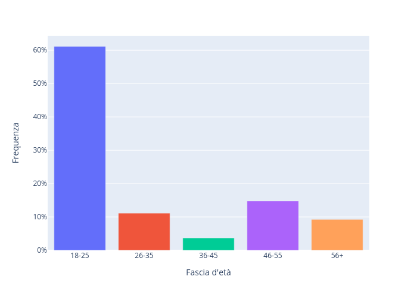

\newpage

# Introduzione

TODO

# Analisi dei dati raccolti

{ width=50% }
{ width=50% }

<!--
\begin{figure}[!h]
\caption{}
\end{figure}
-->

{ width=50% }
{ width=50% }

{ width=50% }
{ width=50% }

{ width=80% }
\begin{figure}[!h]
\centering
\caption{}
\end{figure}
