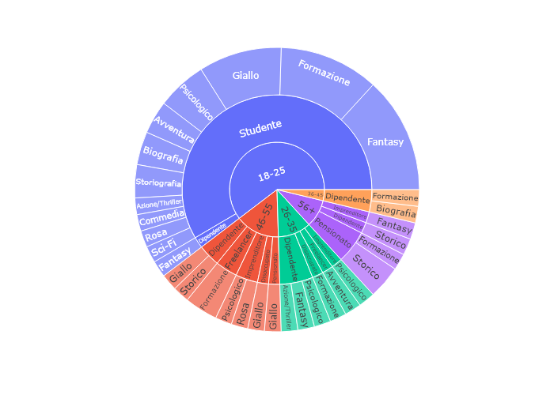
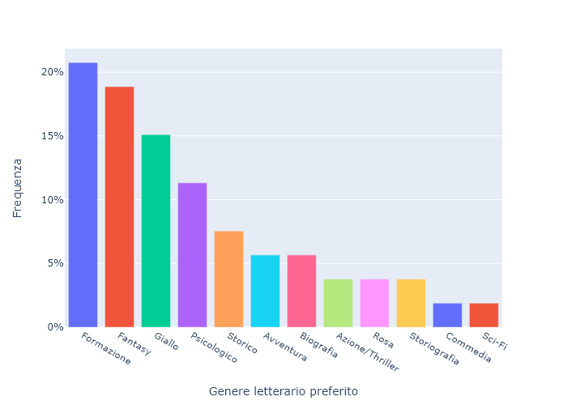
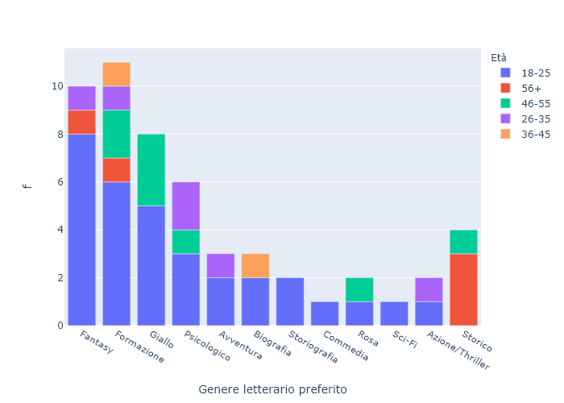
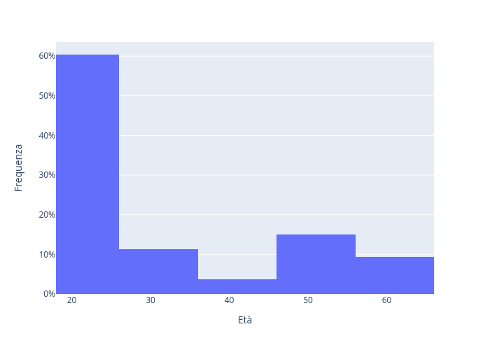
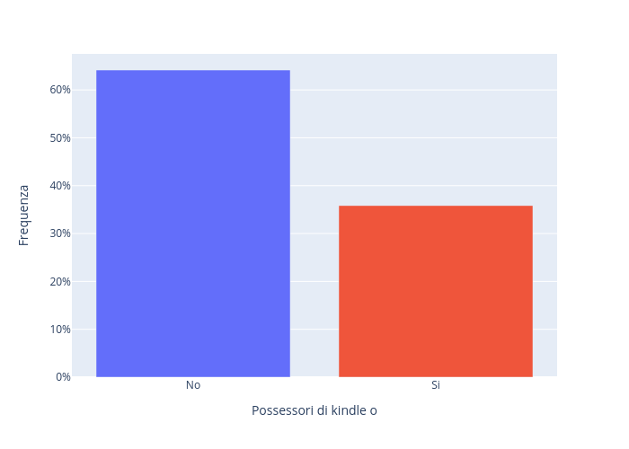
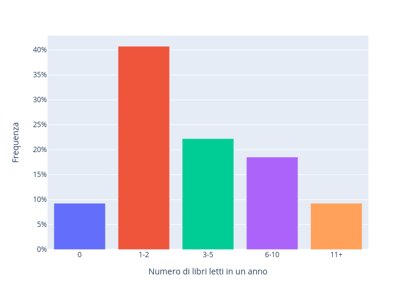
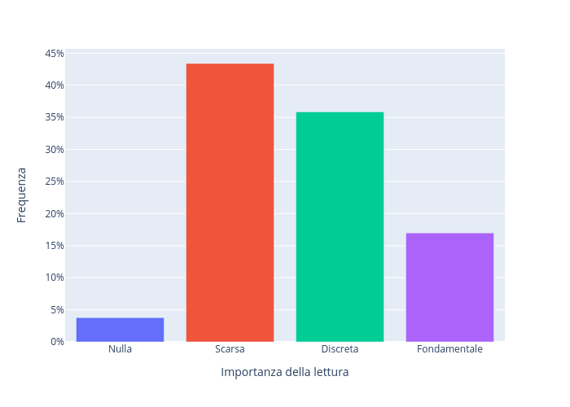
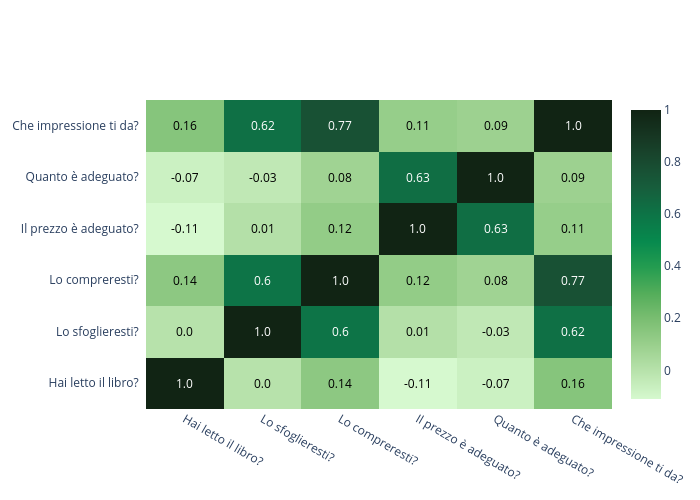

\newpage

# Introduzione

Il seguente elaborato espone il processo di analisi dei dati ottenuti in seguito al dispiegamento di un task di Crowdsourcing, ottenuti attraverso le metodologie offerte dal framework *Crowd Frame*. In particolare, il lavoro è stato suddiviso nelle seguenti fasi:

- [Ottenimento dei dati serializzati su un bucket Amazon S3](#recupero-dati)
- [Analisi dei dati e produzioni di grafici esplicativi](#analisi-dati)

# Recupero dei dati {#recupero-dati}

I dati relativi allo svolgimento del task da parte di ogni singolo worker sono stati serializzati direttamente da *Crowdframe* in diversi documenti JSON all'interno del bucket Amazon S3 predisposto.
I dati raccolti sono stati scaricati tramite gli script descritti nell'elaborato precedente.

Il task è stato svolto da un totale di **54 worker**, dei quali 6 appartenenti rispettivamente a due gruppi coinvolti nello svolgimento del medesimo task e 48 reclutati al fine di incrementare la numerosità dei dati acquisiti. 

Per ogni worker, è stata scaricata una directory contenente i dati di completamente del task (denominata in base all'id del worker). L'insieme dei dati raccolti è situato all'interno della directory `Data`.

\newpage

# Analisi dei dati raccolti {#analisi-dati}

L'analisi dei dati è contenuta all'interno della directory `pyAnalysis` ed è stata svolta all'interno di un apposito Jupyter Notebook.

## Osservazione dei dati ottenuti dal questionario 

Al fine di rendere possibile una visualizzazione d'insieme in merito alle compilazione del questionario introduttivo, è stato prodotto il seguente diagramma "sunburst". 

\newpage

Inoltre, sono stati prodotti istogrammi e diagrammi a barre relativi alla frequenza relativa di ogni variabile campionata per mezzo del questionario.

{ width=47% }
{ width=47% }
\begin{figure}[!h]
\caption{Barplot relativo al genere letterario preferito, anche in relazione all'età}
\end{figure}

{ width=47% }
{width=47% }
\begin{figure}[!h]
\caption{Istogramma in relazione all'età e barplot relativo ai possessori di \textit{eBook Reader}}
\end{figure}

{ width=47% }
{ width=47% }
\begin{figure}[!h]
\caption{Barplot relativi alle preferenze in relazione alla lettura}
\end{figure}

## Osservazione dei dati relativi alle dimensioni proposte

### Grado medio di adeguatezza del prezzo 

Per ogni edizione presa in analisi, è stato calcolato il grado medio di adeguatezza del prezzo sulla base delle risposte fornite dai worker.
In particolare, ogni worker poteva fornite una risposta tramite l'apposito slider con valori inclusi fra 0 e 5 (rispettivamente riferiti alla **totale adeguatezza** e **ineguatezza** del prezzo). 

\begin{table}[H]
\centering
\begin{tabular}{|l|c|c|}
\hline
\multicolumn{1}{|c|}{\textbf{Titolo}} & \textbf{Il prezzo è adeguato?} & \textbf{Quanto è adeguato?} \\ \hline
Le cronache di Narnia (italiano, cartaceo)          & 0.944444 & 3.944444 \\ \hline
Le cronache di Narnia (italiano, eBook)             & 0.777778 & 3.777778 \\ \hline
The Chronicles of Narnia (inglese, cartaceo)        & 0.833333 & 3.222222 \\ \hline
Assassinio sull'Orient Express (italiano, cartaceo) & 0.833333 & 3.666667 \\ \hline
Assassinio sull'Orient Express (italiano, eBook)    & 0.722222 & 3.444444 \\ \hline
Assassinio sull'Orient Express(inglese, cartaceo)   & 0.833333 & 3.888889 \\ \hline
Così parlò Zarathustra (italiano, cartaceo)         & 0.833333 & 3.666667 \\ \hline
Così parlò Zarathustra (italiano, eBook)            & 0.722222 & 3.666667 \\ \hline
Così parlò Zarathustra (inglese, cartaceo)          & 0.777778 & 3.611111 \\ \hline
\end{tabular}
\end{table}

Altra tabella

\begin{table}[H]
\centering
\begin{tabular}{|r|r|r|}
\hline
\multicolumn{1}{|c|}{\textbf{Metrica}} & \multicolumn{1}{c|}{\textbf{Il prezzo è adeguato?}} & \multicolumn{1}{c|}{\textbf{Quanto è adeguato?}} \\ \hline
Le cronache di Narnia (italiano, cartaceo)          & 1.0 & 4.0 \\ \hline
Le cronache di Narnia (italiano, eBook)             & 1.0 & 4.0 \\ \hline
Le cronache di Narnia (inglese, cartaceo)           & 1.0 & 3.0 \\ \hline
Assassinio sull'Orient Express (italiano, cartaceo) & 1.0 & 4.0 \\ \hline
Assassinio sull'Orient Express (italiano, eBook)    & 1.0 & 4.0 \\ \hline
Assassinio sull'Orient Express(inglese, cartaceo)   & 1.0 & 4.0 \\ \hline
Così parlò Zarathustra (italiano, cartaceo)         & 1.0 & 3.5 \\ \hline
Così parlò Zarathustra (italiano, eBook)            & 1.0 & 4.0 \\ \hline
Così parlò Zarathustra (inglese, cartaceo)          & 1.0 & 3.5 \\ \hline
\end{tabular}
\end{table}

Altra tabella

\begin{table}[H]
\centering
\begin{tabular}{l|r|c|c|c|c|}
\cline{2-6}
 &
  \multicolumn{1}{c|}{\textbf{Libro}} &
  \textbf{Tipo di libro} &
  \textbf{Il prezzo è adeguato?} &
  \multicolumn{1}{l|}{\textbf{Tipo di libro}} &
  \multicolumn{1}{l|}{\textbf{Quanto è adeguato?}} \\ \hline
\multicolumn{1}{|l|}{\multirow{3}{*}{\textbf{Massimo}}} & Le cronache di Narnia          & italiano, cartaceo & 0.944444 & italiano, cartaceo & 3.944444 \\ \cline{2-6} 
\multicolumn{1}{|l|}{}                                  & Assassinio sull'Orient Express & italiano, cartaceo & 0.833333 & inglese, cartaceo  & 3.888889 \\ \cline{2-6} 
\multicolumn{1}{|l|}{}                                  & Così parlò Zarathustra         & italiano, cartaceo & 0.833333 & italiano, cartaceo & 3.666667 \\ \hline
\multicolumn{1}{|l|}{\multirow{3}{*}{\textbf{Minimo}}}  & Le cronache di Narnia          & italiano, eBook    & 0.777778 & inglese, cartaceo  & 3.222222 \\ \cline{2-6} 
\multicolumn{1}{|l|}{}                                  & Assassinio sull'Orient Express & italiano, eBook    & 0.722222 & italiano, eBook    & 3.444444 \\ \cline{2-6} 
\multicolumn{1}{|l|}{}                                  & Così parlò Zarathustra         & italiano, cartaceo & 0.722222 & italiano, eBook    & 3.611111 \\ \hline
\end{tabular}
\end{table}

{ width=80% }

# Conclusioni
